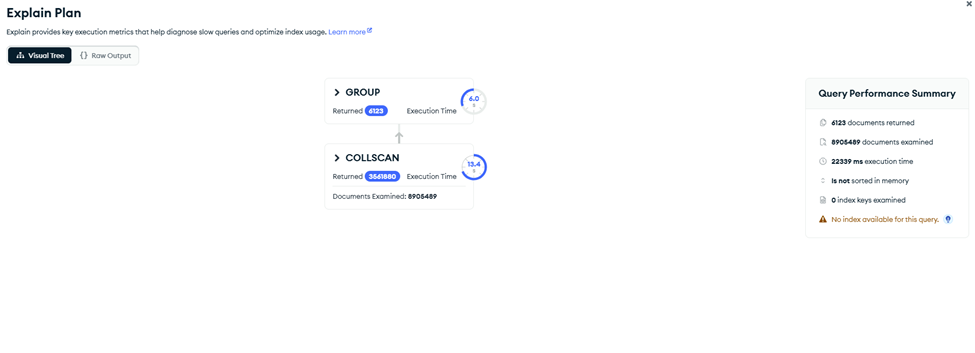
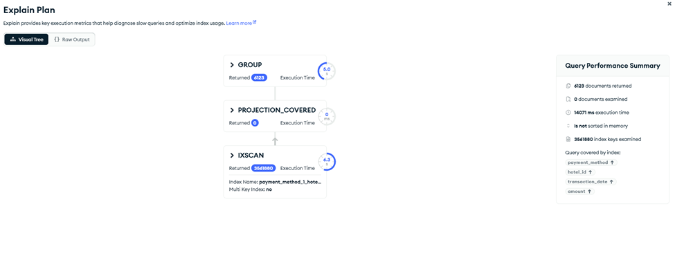
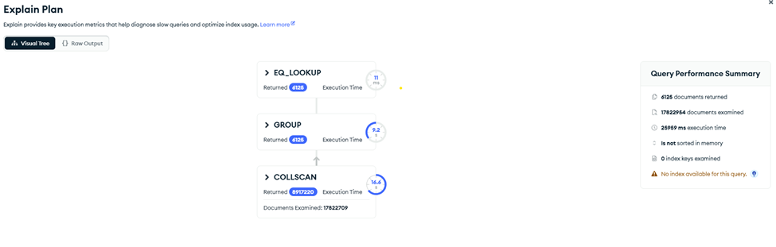
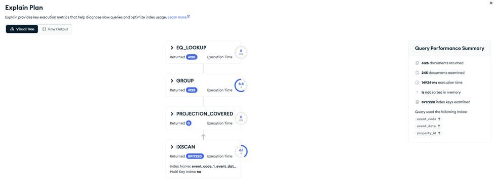

# MongoDB Indexes for Query Optimization

These indexes are created on the `hotel_sql_mirror` database to optimize the Query List 2 aggregation pipelines.

---

## Index 1: Revenue by Property (Monthly through American and Discover only) 

**Supports**: Query 1 - Revenue by Property (Monthly through American and Discover only)  
**Collection**: `transact`  
**Index used**: `payment_method_1_hotel_id_1_transaction_date_1_amount_1`  
**Performance Improvement**:  
***Before Indexing***

***After Indexing***

**Why this helps**: This query filters transactions by payment_method (American and Discover), groups results by hotel_id and aggregates revenue by year and month from transaction_date. The compound index on (payment_method, hotel_id, transaction_date, amount) allows MongoDB to quickly locate only relevant transactions and perform an index scan instead of a full collection scan. As a result, fewer documents are examined and aggregation executes significantly faster.

---

## Index 2: Revenue by Product/Service

**Supports**: Query 2 - Revenue by Product/Service  
**Collection**: `transaction_line`  
**Index used**: tbd 

**Why this helps**: The aggregation groups by `description` across 29.4M documents. An index on `description` allows MongoDB to efficiently group matching documents together rather than performing a full collection scan.

---

## Index 3: Check-in Volume by Property

**Supports**: Query 3 - Check-in Volume by Property  
**Collection**: `event`  
**Index used**: `event_code_1_event_date_1_property_id_1`  
**Performance Improvement**:  
***Before Indexing*** 

***After Indexing*** 

**Why this helps**: The pipeline first filters events using event_code = "checkin" and then aggregates check-ins by month using event_date and by property using property_id. The compound index (event_code, event_date, property_id) lets MongoDB use an index scan instead of a full collection scan, so far fewer event documents are read before grouping and the $lookup. This reduces documents examined and improves overall runtime on the ~17.8M event records.

---

## How to Create These Indexes

### Using MongoDB Compass (GUI)
1. Connect to `cis444.campus-quest.com:25010`
2. Select `hotel_sql_mirror` database
3. Click on the collection (e.g., `transact`)
4. Go to the **Indexes** tab
5. Click **"Create Index"**
6. Add each field and set direction to `1` (ascending)
7. Click **"Create Index"**

